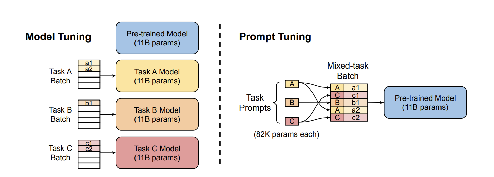
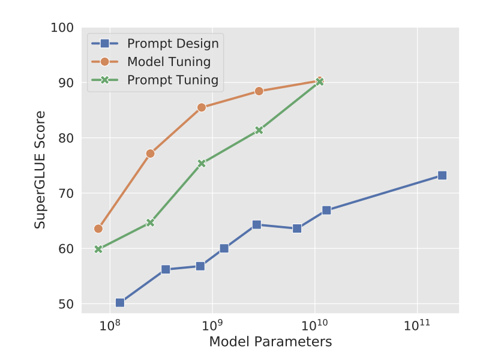

# Prompt engineering

There are several ways to adapt the behaviour of large-scale language models to concrete tasks, such as sentiment analysis o topic classification.

* Model tuning \(also known as finetuning\): optimizes the weights of the model for the new dataset. The main drawback is that we have to store a copy of the model for every task.
* Prompt design: what is usually done with the biggest models, such as GPT-3. The problem is that it involves a lot of test and error and human times.
* Prompt tuning: [https://arxiv.org/abs/2104.08691](https://arxiv.org/abs/2104.08691). We'll focus on this one in the rest of this document.

By using an autorregresive model as a classifier, we model the problem as $$P_\theta(Y|X)$$, in which $$X$$is the text sequence to be classified, $$Y$$, the token referring to its classification, and $$\theta$$the weights of the model. Whereas prompt design involves in optimizing a discrete prefix of words $$P$$in the likelihood $$P_\theta(Y|[P; X])$$, prompt tuning introduces a complementary set of weights $$\theta_P$$, of much lower cardinality than the model's, and optimizing $$P_{\theta, \theta_P}(Y|[P; X])$$while keeping the prefix $$P$$ fixed.

The following figure summarizes the idea, notice the reduction in tunneable parameters and that we can simultaneously optimize for multiple tasks.  

And the following graph shows the performance of this new technique, using T5.  

